#### <div align="end">Вайцеховський Олександр ІПЗ 3-02</div>  
### <div align="center">Практично-лабораторне заняття №4</div>  
#### Тема: Реалізація нової сутності, створення CRUD-операцій та відповідного RESTful API
#### Мета: Закріпити навички створення повноцінної серверної логіки для роботи з новою сутністю за допомогою TypeORM, Express та TypeDI. Ознайомитися з процедурою створення міграцій, перевірки змін у структурі бази даних та тестування REST API через Postman.

#### Хід роботи:  
0. Ознайомлення репозиторію із бойлерплейтом за посиланням 
https://github.com/mkosir/typeorm-express-typescript  
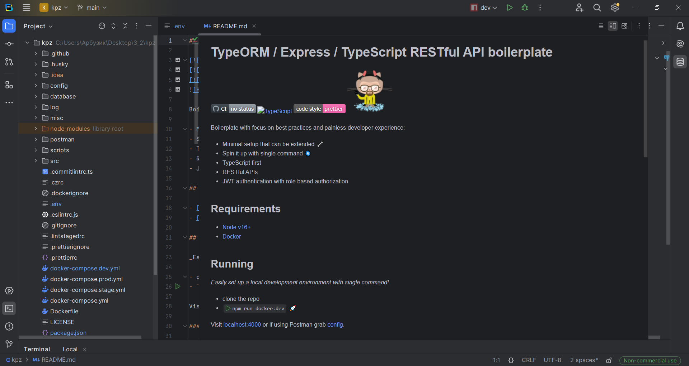  
1. Створення нової сутності Post:
...*Спочатку створимо файл сутності та типів:  
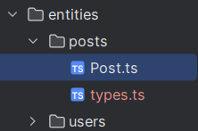

- Після цього за допомогою ORM тайпкрипту обозначому описані поля:
	- id: UUID, первинний ключ  
	- post_name: рядок, обов’язковий  
	- post_description: текст, необов’язковий  
	- createdAt: дата створення, автоматично заповнюється  
	- updatedAt: дата оновлення, автоматично оновлюється  
- Вміст файлу Post.ts:  
```typescript
import { Entity, PrimaryGeneratedColumn, Column, CreateDateColumn, UpdateDateColumn, ManyToOne } from 'typeorm';
import { Language } from './types';
import { User } from '../users/User';

@Entity('post')
export class Post {
  @PrimaryGeneratedColumn()
  id: number;

  @Column({
    name: 'post_name',
    default: false,
    nullable: false,
    length: 100,
  })
  postName: string;

  @Column({
    name: 'post_description',
    nullable: false,
    unique: false,
    length: 255,
  })
  postDescription: string;

  @Column({
    default: 'en-US' as Language,
    length: 15,
  })
  language: string;

  @Column()
  @CreateDateColumn()
  created_at: Date;

  @Column()
  @UpdateDateColumn()
  updated_at: Date;

  setLanguage(language: Language) {
    this.language = language;
  }
}
```
- Вміст файлу types.ts:
```typescript
export type Language = 'en-US' | 'sl-SI';
```  
2. Створення та застосування міграції:  
- Генерування нової міграції  
  
 Результат міграції:  
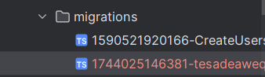   
- Вміст файлу міграції  
```typescript
import {MigrationInterface, QueryRunner} from "typeorm";

export class tesadeaweqw111231744025146381 implements MigrationInterface {
    name = 'tesadeaweqw111231744025146381'

    public async up(queryRunner: QueryRunner): Promise<void> {
        await queryRunner.query(`
            ALTER TABLE "post"
            ADD "author_id" integer
        `);
        await queryRunner.query(`
            ALTER TABLE "post"
            ADD CONSTRAINT "FK_2f1a9ca8908fc8168bc18437f62" FOREIGN KEY ("author_id") REFERENCES "users"("id") ON DELETE NO ACTION ON UPDATE NO ACTION
        `);
    }

    public async down(queryRunner: QueryRunner): Promise<void> {
        await queryRunner.query(`
            ALTER TABLE "post" DROP CONSTRAINT "FK_2f1a9ca8908fc8168bc18437f62"
        `);
        await queryRunner.query(`
            ALTER TABLE "post" DROP COLUMN "author_id"
        `);
    }

}

```  
- Запуск міграції  

- Перевірка бази даних на зміни  
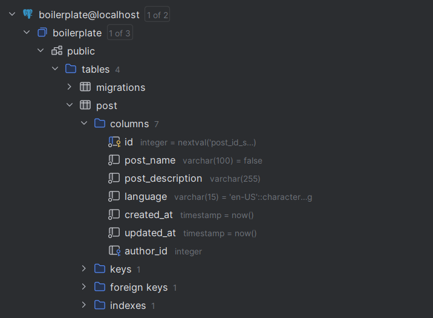  

3. Реалізація RESTful API для CRUD-операцій:  
- Спочатку створимо такі файли у зазначеній директорії:  
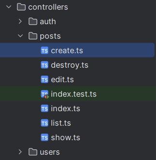  
- Create: створення нового поста:  
```typescript
import { Request, Response, NextFunction } from 'express';
import { getRepository } from 'typeorm';

import { Post } from 'orm/entities/posts/Post';
import { CustomError } from 'utils/response/custom-error/CustomError';
import { User } from '../../orm/entities/users/User';

export const create = async (req: Request, res: Response, next: NextFunction) => {
  const { postName, postDescription, userId } = req.body;

  const postRepository = getRepository(Post);
  const userRepository = getRepository(User);
  try {
    try {
      const user = await userRepository.findOne(userId);

      if (!user) {
        const customError = new CustomError(404, 'General', `User with id ${userId} not found`);
        return next(customError);
      }

      const newPost = new Post();
      newPost.postName = postName;
      newPost.postDescription = postDescription;
      newPost.author = user;
      await postRepository.save(newPost);
      res.customSuccess(200, 'Post successfully created.');
    } catch (err) {
      const customError = new CustomError(400, 'Raw', `Post '${postName}' can't be created`, null, err);
      return next(customError);
    }
  } catch (err) {
    const customError = new CustomError(400, 'Raw', 'Error', null, err);
    return next(customError);
  }
};
```  
- Read:  
- отримання всіх постів  
```typescript
import { Request, Response, NextFunction } from 'express';
import { getRepository } from 'typeorm';

import { Post } from 'orm/entities/posts/Post';
import { CustomError } from 'utils/response/custom-error/CustomError';

export const list = async (req: Request, res: Response, next: NextFunction) => {
  const postRepository = getRepository(Post);
  try {
    const posts = await postRepository.find({
      relations: ['author'],
      select: ['id', 'postName', 'postDescription', 'language', 'created_at', 'updated_at'],
    });

    const sanitizedPosts = posts.map(post => ({
      ...post,
      author: post.author ? {
        id: post.author.id,
        username: post.author.username,
        name: post.author.name
      } : null
    }));

    res.customSuccess(200, 'List of posts.', sanitizedPosts);
  } catch (err) {
    const customError = new CustomError(400, 'Raw', `Can't retrieve list of posts.`, null, err);
    return next(customError);
  }
};
```
- отримання одного поста за ID  
```typescript
import { Request, Response, NextFunction } from 'express';
import { getRepository } from 'typeorm';

import { Post } from 'orm/entities/posts/Post';
import { CustomError } from 'utils/response/custom-error/CustomError';

export const show = async (req: Request, res: Response, next: NextFunction) => {
  const id = req.params.id;

  const postRepository = getRepository(Post);
  try {
    const post = await postRepository.findOne(String(id), {
      relations: ['author'],
      select: ['id', 'postName', 'postDescription', 'language', 'created_at', 'updated_at'],
    });

    if (!post) {
      const customError = new CustomError(404, 'General', `Post with id:${id} not found.`, ['Post not found.']);
      return next(customError);
    }

    const sanitizedPost = {
      ...post,
      author: post.author ? {
        id: post.author.id,
        username: post.author.username,
        name: post.author.name
      } : null
    };

    res.customSuccess(200, 'Post found', sanitizedPost);
  } catch (err) {
    const customError = new CustomError(400, 'Raw', 'Error', null, err);
    return next(customError);
  }
};
```  

- Update: оновлення поста за ID  
```typescript
import { Request, Response, NextFunction } from 'express';
import { getRepository } from 'typeorm';

import { Post } from 'orm/entities/posts/Post';
import { CustomError } from 'utils/response/custom-error/CustomError';

export const edit = async (req: Request, res: Response, next: NextFunction) => {
  const id = req.params.id;
  const { postName, postDescription } = req.body;

  const postRepository = getRepository(Post);
  try {
    const post = await postRepository.findOne({ where: { id } });

    if (!post) {
      const customError = new CustomError(404, 'General', `Post with id:${id} not found.`, ['Post not found.']);
      return next(customError);
    }

    post.postName = postName;
    post.postDescription = postDescription;

    try {
      await postRepository.save(post);
      res.customSuccess(200, 'User successfully saved.');
    } catch (err) {
      const customError = new CustomError(409, 'Raw', `Post '${post.postName}' can't be saved.`, null, err);
      return next(customError);
    }
  } catch (err) {
    const customError = new CustomError(400, 'Raw', 'Error', null, err);
    return next(customError);
  }
};
```  
- Delete: видалення поста за ID:  
```typescript
import { Request, Response, NextFunction } from 'express';
import { getRepository } from 'typeorm';

import { CustomError } from 'utils/response/custom-error/CustomError';
import { Post } from 'orm/entities/posts/Post';

export const destroy = async (req: Request, res: Response, next: NextFunction) => {
  const id = req.params.id;

  const postRepository = getRepository(Post);
  try {
    const post:Post = await postRepository.findOne({ where: { id } });

    if (!post) {
      const customError = new CustomError(404, 'General', 'Not Found', [`Post with id:${id} doesn't exists.`]);
      return next(customError);
    }
    postRepository.delete(id);

    res.customSuccess(200, 'Post successfully deleted.', { id: post.id, postName: post.postName, description: post.postDescription });
  } catch (err) {
    const customError = new CustomError(400, 'Raw', 'Error', null, err);
    return next(customError);
  }
};
```  
- Використання контролер, DTO, роутер та сервіс.  
```typescript
 const sanitizedPost = {
      ...post,
      author: post.author ? {
        id: post.author.id,
        username: post.author.username,
        name: post.author.name
      } : null
    };
```  
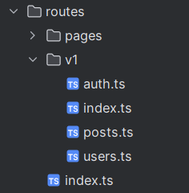  
- Зміст posts.ts
```typescript
import { Router } from 'express';
import { list, show, edit, destroy, create } from 'controllers/posts';
import { checkJwt } from '../../middleware/checkJwt';
import { checkRole } from '../../middleware/checkRole';
import { validatorEdit } from '../../middleware/validation/posts';
const router = Router();
router.get('/', list);
router.get('/:id([0-9]+)', [checkJwt, checkRole(['ADMINISTRATOR'])], show);
router.patch('/:id([0-9]+)', [checkJwt, checkRole(['ADMINISTRATOR'], true), validatorEdit], edit);
router.delete('/:id([0-9]+)', [checkJwt, checkRole(['ADMINISTRATOR'], true)], destroy);
router.post('/create', checkJwt, create);
export default router;
```  
4. Налагодження зв’язку між User і Post:  
- Зв'язок у сутності Post  
```typescript
  @ManyToOne(type => User, user => user.posts)
  author: User;
```
- Зв'язок у сутності User
```typescript
  @OneToMany(type => Post, post => post.author)
  posts: Post[];
```
5. Тестування REST API через Postman:  
- Логін у застосунок  
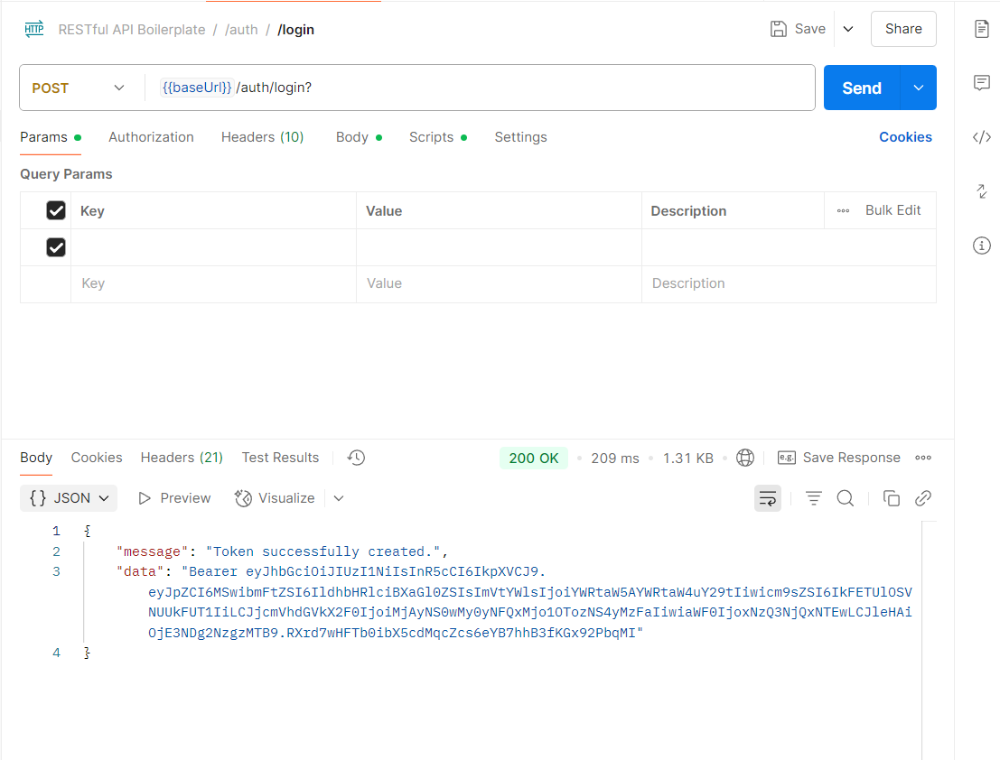  
- Перевірка роботи ендпоінтів:  
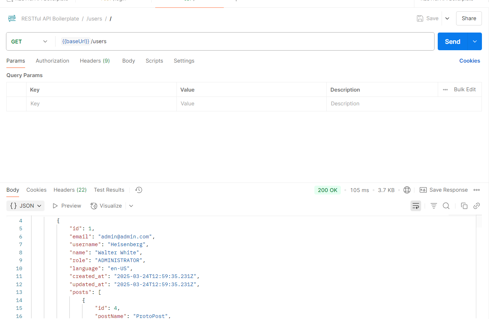  
- Вивід поста із зазначенням його автора  
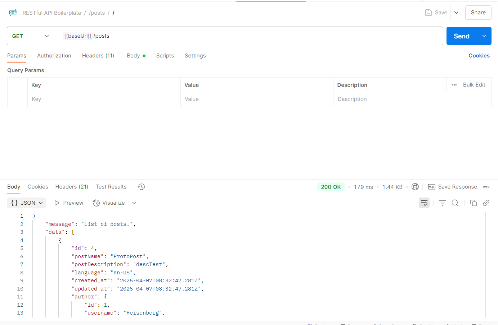  
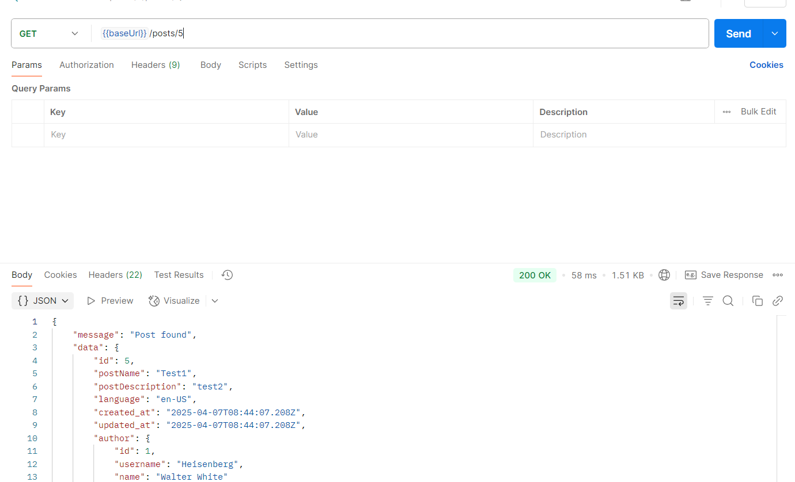  
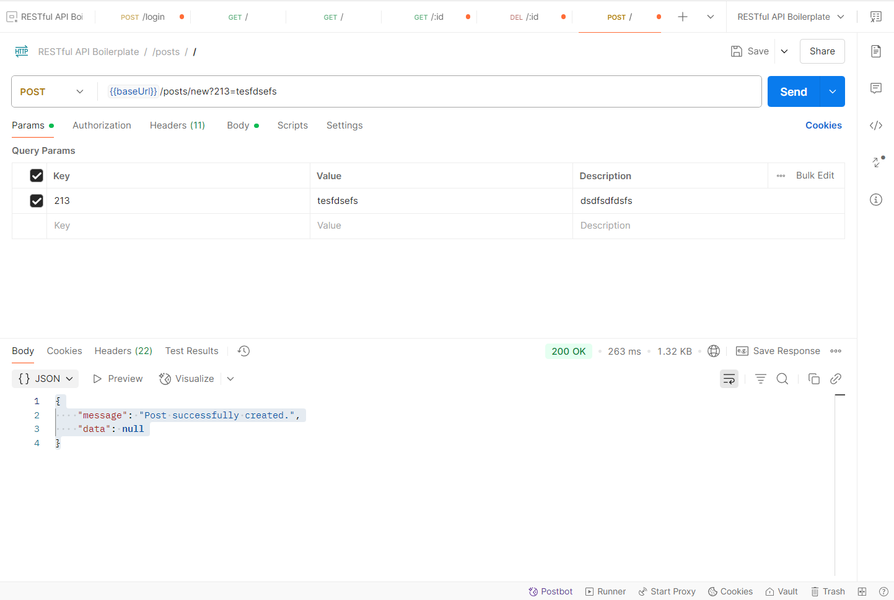  

### Висновки:
Після проходження практичної роботи із дисципліни Конструювання Програмних Застосунків на тему реалізації CRUD операцій у бекенді були засвоєні фундаментальні теоретичні знання із використання засобів ORM у мові програмування typescript та на базі СУБД Postgres SQL.
